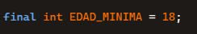
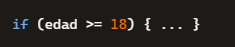
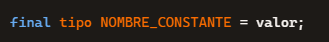
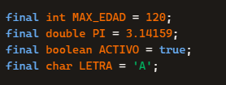
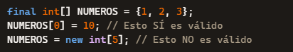
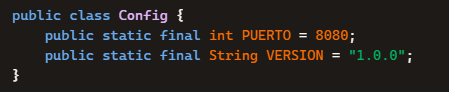
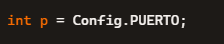
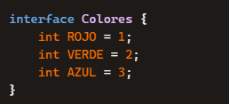
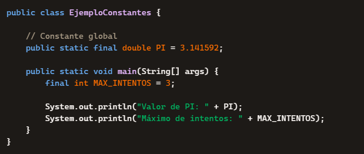

**2\. CONSTANTES**

**🧩 1. ¿Qué es una constante?**

Una **constante** es un valor que **no puede cambiar** durante la ejecución del programa. Una vez asignado, **permanece fijo**.

En Java, las constantes se definen usando:

-   La palabra clave final
-   Un tipo de dato
-   Un nombre (por convención, en MAYÚSCULAS)
-   Un valor asignado una sola vez

**2\. ¿Por qué usar constantes?**

Las constantes aportan varias ventajas:

-   **Evitan errores**: no se pueden modificar accidentalmente.
-   **Mejoran la legibilidad**: un nombre claro es más comprensible que un número suelto.
-   **Facilitan el mantenimiento**: si necesitas cambiar el valor, lo haces en un solo lugar.
-   **Evitan “números mágicos”** en el código.

**Ejemplo sin constante (mala práctica):**

Ejemplo con constante (buena práctica):

**3\. Cómo declarar una constante**

La sintaxis general es:

**✔ Reglas y buenas prácticas**

-   El nombre debe ir en **mayúsculas**.
-   Si tiene varias palabras, se separan con **guiones bajos**: MAX\_VELOCIDAD, PI\_VALOR.
-   Debe inicializarse **en el momento de la declaración** (salvo casos especiales).

**4\. Tipos de constantes**

**🔹 4.1 Constantes primitivas**

Se pueden crear constantes de cualquier tipo primitivo:

**🔹 4.2 Constantes de referencia**

También se pueden declarar constantes de objetos, pero con matices:

👉 **Importante:** final evita que la referencia cambie, pero **no impide modificar el contenido interno** del objeto si es mutable.

Ejemplo:

**5\. Constantes estáticas (static final)**

Cuando una constante pertenece a la **clase** y no a cada objeto, se usa:

Son muy comunes para valores globales.

**Ejemplo:**

Se accede así:

**6\. Constantes en interfaces**

En las interfaces, **todas las variables son automáticamente**:

-   public
-   static
-   final

Por lo tanto, basta con escribir:

**7\. Tabla resumen**

| **Característica** | **Descripción** |
| --- | --- |
| Palabra clave | final |
| Convención de nombre | MAYÚSCULAS_CON_GUIONES_BAJOS |
| Inicialización | Obligatoria |
| Modificable | No (la referencia no cambia) |
| Con objetos | La referencia es constante, el contenido puede no serlo |
| Con static | Constante global de clase |

**8\. Ejemplo completo**

****