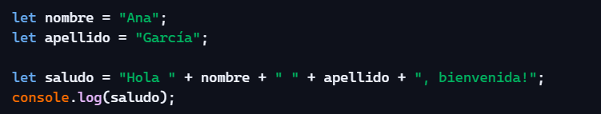
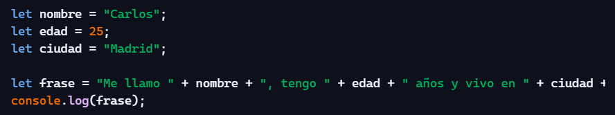
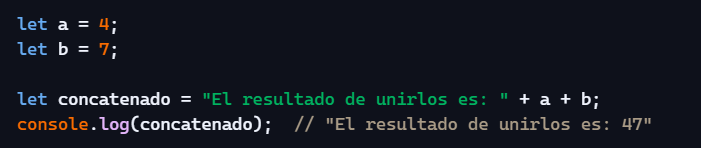
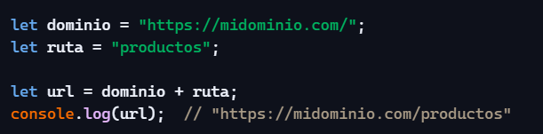
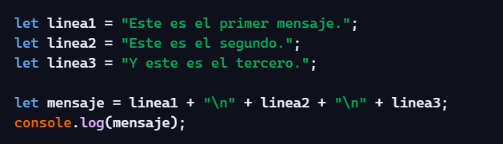
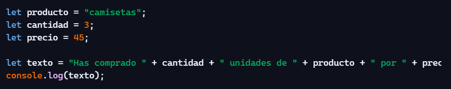
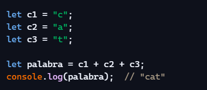
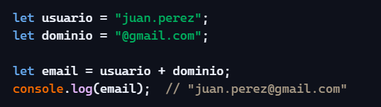
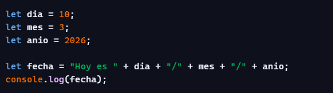
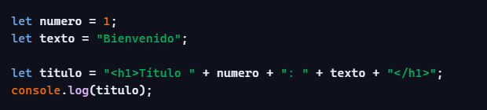

**3\. EJERCICIOS CONCATENACIÓN**

**1\. Saludo personalizado**

Pide al usuario su nombre y apellido (simulado con variables) y muestra un saludo concatenando ambas partes.

****

**2\. Frase con datos de usuario**

Crea variables para nombre, edad y ciudad. Luego construye una frase concatenando todo.

**3\. Concatenar números como texto**

Declara dos números y crea una cadena que diga:

“El resultado de unirlos es: XY”

(no sumarlos, sino unirlos como texto)

****

**4\. Crear una URL dinámica**

Dado un dominio y una ruta, construye una URL completa concatenando ambos.

**5\. Concatenación con saltos de línea**

Crea un mensaje usando concatenación con \\n.

****

**6\. Plantilla de factura simple**

Dado un producto, cantidad y precio, crea una frase concatenada que diga:

“Has comprado X unidades de PRODUCTO por Y euros.”

****

**7\. Concatenar caracteres**

Dadas tres letras en variables separadas, únelas en una sola palabra.

**8\. Crear un email automáticamente**

Dado un nombre de usuario y un dominio, genera un email concatenado.

**9\. Generar una frase con fecha completa**

Crea variables para el día, mes y año. Luego construye una cadena que muestre la fecha en formato:

“Hoy es DD/MM/AAAA”

Usa concatenación con +

**10\. Crear un título HTML dinámico**

Dado un texto base y un número, crea una cadena que represente un título HTML, por ejemplo:

“<h1>Título 1: Bienvenido</h1>”

Usa concatenación para unir las partes.

