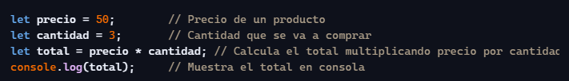
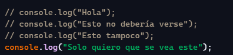
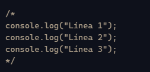
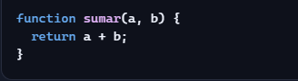
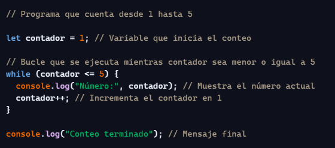

**3\. COMENTARIOS**

**🧩 Ejercicio 1: Añade comentarios**

Agrega comentarios explicando qué hace cada línea:

🧩 **Ejercicio 2: Desactiva código**

Solo debe ejecutarse el último console.log:

🧩 **Ejercicio 3: Comentarios multilínea**

Convierte este bloque en un comentario multilínea:

**Ejercicio 4: Documenta una función**

Añade comentarios explicando qué hace esta función:

**Ejercicio 5: Reto creativo (ejemplo de solución)**

Escribe un pequeño programa (5–10 líneas) y añade comentarios que expliquen:

-   Qué hace el programa
-   Qué hace cada variable
-   Qué hace cada paso

Por ejemplo, un contador, un saludo personalizado, un cálculo, etc.

